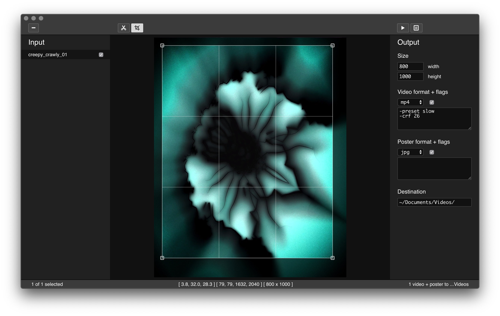

# ffEdit

> Minimal visual editor for ffmpeg

## Features

- Trim start / end of videos
- Crop videos to output aspect ratio
- Automatically generate video poster images
- Configure ffmpeg flags for poster and video outputs
- Batch encoding

## Requirements

- System ffmpeg (4.x)
